# 🎮 보자마자 PLAY2 (Bojamaja PLAY2)

<p align="center">
  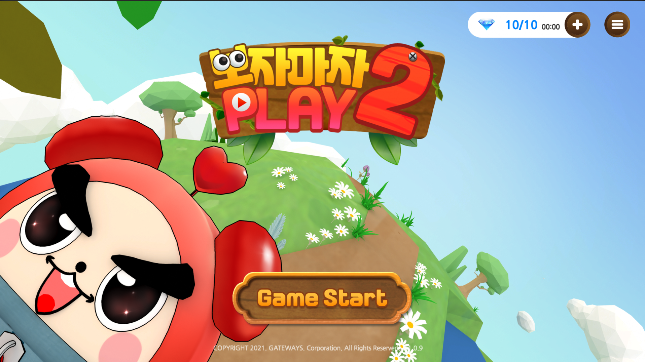
</p>

**캐주얼 모바일 미니게임 모음집**
초기에는 단순히 랜덤으로 10개의 게임을 30초씩 플레이하는 구조였으나,
후반에는 **클래식 모드 / 랭킹 모드**가 추가되어 확장된 게임성을 제공합니다.

- **클래식 모드** : 원하는 게임을 골라 30초 동안 플레이, 획득 점수에 따라 별(★) 부여
- **랭킹 모드** : 10개의 랜덤 게임을 연속 플레이 후 총 점수로 세계 랭킹 경쟁
- 모바일 AdMob 연동, 순위 등록/랭킹 시스템, 데이터 저장 포함

## 📅 개발 정리

| 구분                 | 내용                                                                                                                                                                                                                                                                           |
| -------------------- | ------------------------------------------------------------------------------------------------------------------------------------------------------------------------------------------------------------------------------------------------------------------------------ |
| **개발 기간 / 역할** | **2021.06 \~ 2021.12 (6개월)**<br>팀 프로젝트 (개발 4명)<br>UI/게임 로직/랭킹 시스템/클래식 모드 개발                                                                                                                                                                          |
| **플랫폼**           | Android / iOS (모바일 배포 중심)                                                                                                                                                                                                                                               |
| **기술 스택**        | Unity3D (C#)<br>AdMob 광고 연동<br>Firebase 기반 순위 관리<br>모바일 최적화                                                                                                                                                                                                    |
| **주요 기여**        | - 랭킹 모드 시스템 설계 (10개 랜덤 게임 → 총점 계산 → 랭킹 등록)<br>- 클래식 모드 개발 (별점 기반 보상 시스템)<br>- UI/UX 흐름 설계 (메인 → 모드 선택 → 게임 → 결과 → 랭킹 등록)<br>- AdMob 광고 연동 및 Firebase 기반 데이터 관리<br>- 최적화 (FPS 안정화, 씬 전환 속도 개선) |
| **성과**             | - 단일 앱에 10종 이상의 미니게임 통합<br>- 모바일 클래식/랭킹 모드로 차별화<br>- Firebase 랭킹 연동으로 글로벌 경쟁 가능<br>- 광고/인앱결제 연동을 통한 서비스형 구조 완성                                                                                                     |

## 🎮 게임 모드 소개

| 모드            | 설명                                                                           |
| --------------- | ------------------------------------------------------------------------------ |
| **클래식 모드** | 원하는 미니게임을 골라 30초 플레이, 획득 점수에 따라 별(★) 보상                |
| **랭킹 모드**   | 10개 미니게임을 랜덤 순서로 30초씩 플레이, 총 점수를 기반으로 글로벌 랭킹 등록 |

<p align="center">
  
  
</p>

## 🎲 포함된 미니게임

| 게임 이름               | 설명                                            | 이미지                                              |
| ----------------------- | ----------------------------------------------- | --------------------------------------------------- |
| **장난감을 조립하라**   | 주어진 블록을 순서대로 배치해 완성하기          | 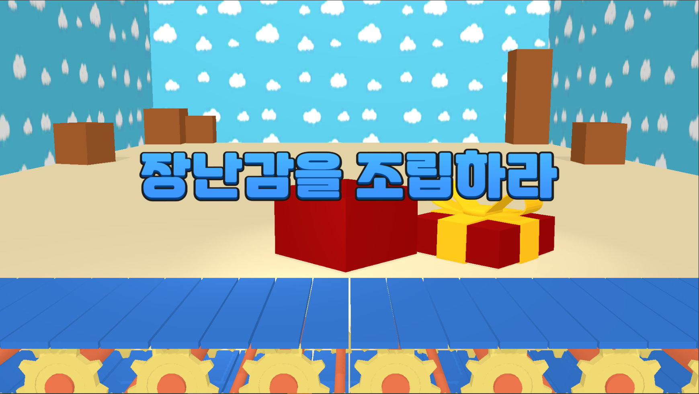        |
| **볼링공을 굴려라**     | 볼링공을 굴려 핀을 쓰러뜨리는 캐주얼 게임       | 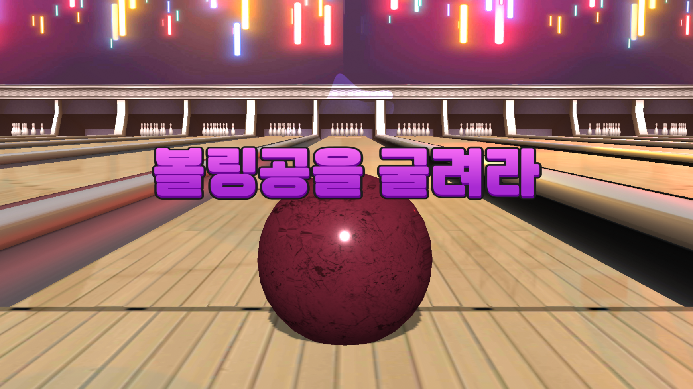    |
| **해적선을 맞춰라**     | 대포를 발사해 해적선을 명중시키는 슈팅 게임     | 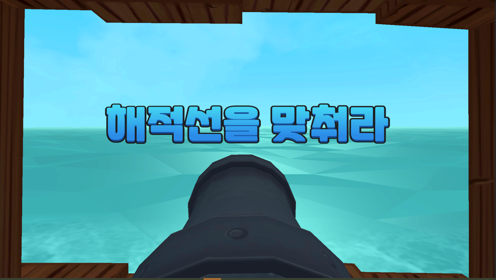    |
| **전골을 끓여라**       | 재료를 순서대로 넣어 요리를 완성하는 게임       | 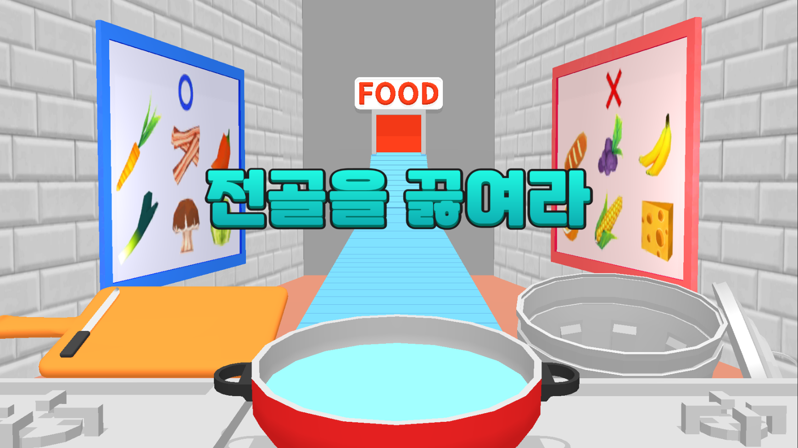     |
| **보석을 찾아라**       | 숨겨진 보석을 찾아 터치하는 미니 퍼즐           | 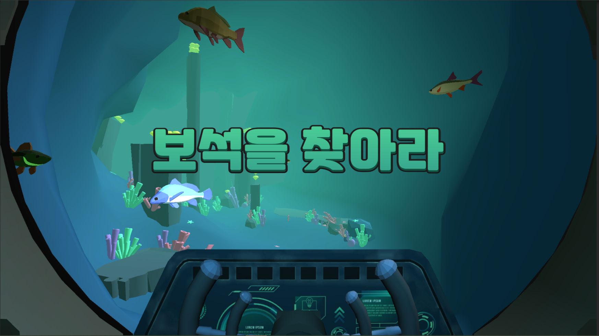   |
| **축구공을 넣어라**     | 축구공을 골대 안으로 넣는 미니 스포츠 게임      | 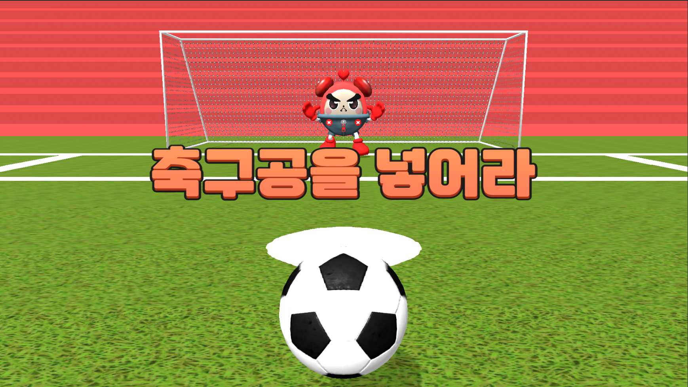     |
| **좀비를 막아라**       | 다가오는 좀비를 터치로 막아내는 액션 게임       | 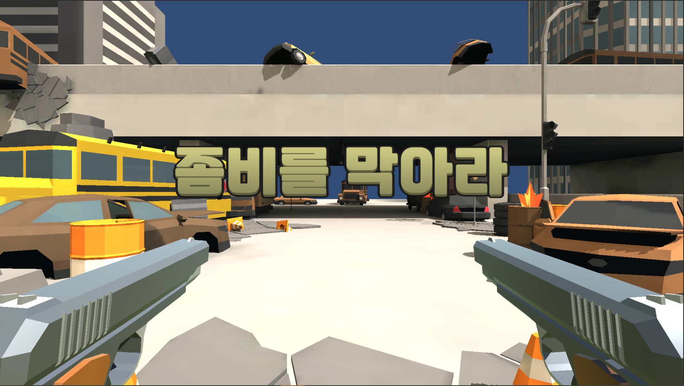     |
| **피자 도우를 돌려라**  | 도우를 돌려 일정 크기로 만드는 타이밍 액션 게임 | 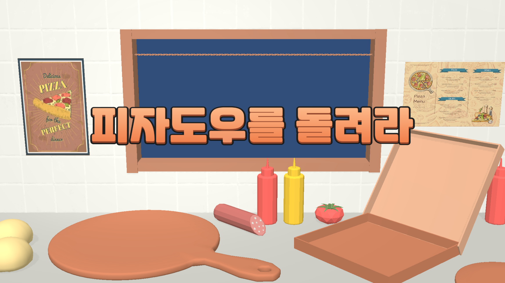      |
| **먼지를 털어라**       | 화면을 스와이프해 먼지를 털어내는 청소 미니게임 | 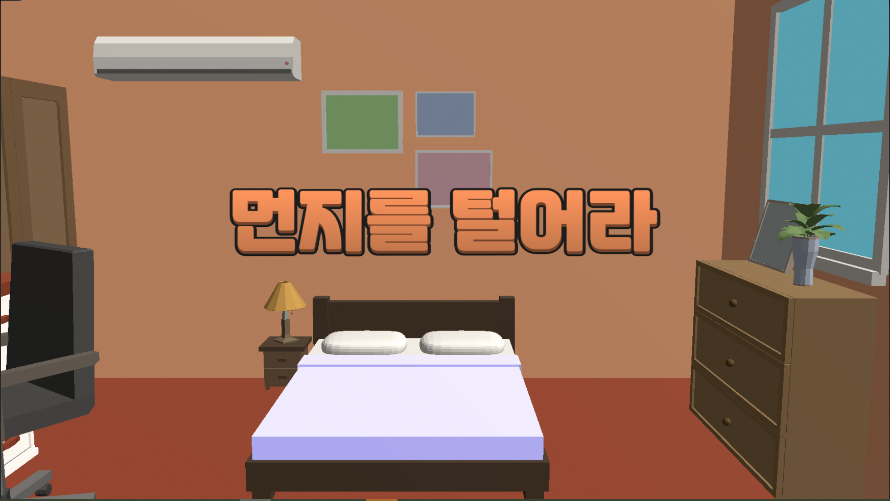       |
| **샌드위치를 만들어라** | 재료를 순서대로 쌓아 올려 완성하는 퍼즐형 게임  | 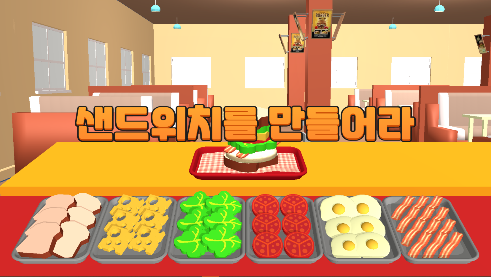 |

## 📸 게임 화면 & 시연

| **타이틀 화면**                                                                          | **게임 선택**                                                                            | **랭킹 등록**                                                                            | **결과 화면**                                                                            | **상점 화면**                                                                            |
| ---------------------------------------------------------------------------------------- | ---------------------------------------------------------------------------------------- | ---------------------------------------------------------------------------------------- | ---------------------------------------------------------------------------------------- | ---------------------------------------------------------------------------------------- |
| 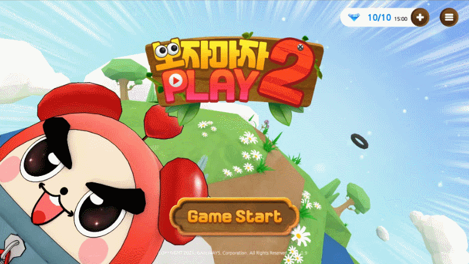 | 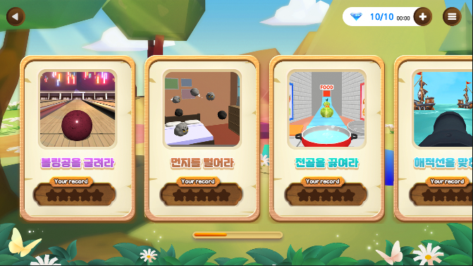 | 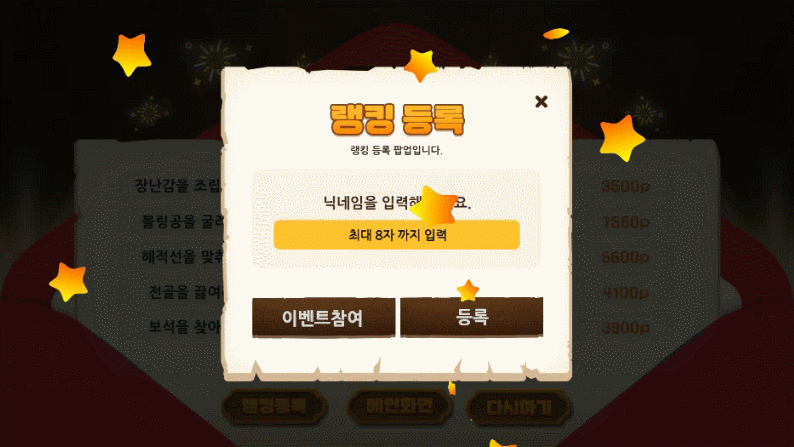 | 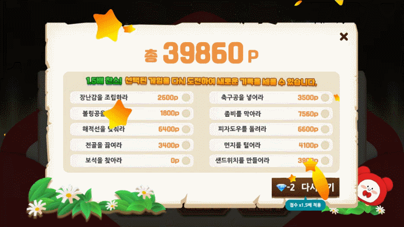 |  |

## 🔍 코드 구조 (일부)

```
BojamajaPLAY2/
├── Managers/
│   ├── GameManager.cs        # 전체 게임 진행 관리 (모드 전환, 타이머)
│   ├── ScoreManager.cs       # 점수, 별 획득 계산
│   ├── RankingManager.cs     # Firebase 기반 랭킹 등록/조회
│   └── UIManager.cs          # 화면 전환 및 UI 흐름
│
├── Games/
│   ├── ToyAssemble.cs        # 장난감 조립 게임 로직
│   ├── BowlingGame.cs        # 볼링 미니게임
│   ├── ZombieDefense.cs      # 좀비 방어 게임
│   └── ...                   # 나머지 미니게임 스크립트
│
├── Ads/
│   └── AdManager.cs          # AdMob 보상형 광고 처리
```

---

## 📂 주요 코드 예시

```csharp
// GameManager.cs
public class GameManager : MonoBehaviour
{
    public int totalScore = 0;
    public int currentGame = 0;

    public void AddScore(int score)
    {
        totalScore += score;
    }

    public void NextGame()
    {
        currentGame++;
        if (currentGame >= 10) ShowResult();
        else LoadNextGame();
    }
}
```

```csharp
// ScoreManager.cs (클래식 모드 - 별 획득 로직)
public int GetStarRating(int score)
{
    if (score >= 5000) return 3;
    if (score >= 3000) return 2;
    return 1;
}
```

```csharp
// RankingManager.cs (Firebase 연동)
public void SubmitScore(string nickname, int score)
{
    DatabaseReference dbRef = FirebaseDatabase.DefaultInstance.RootReference;
    string key = dbRef.Child("ranking").Push().Key;

    RankData data = new RankData(nickname, score);
    string json = JsonUtility.ToJson(data);
    dbRef.Child("ranking").Child(key).SetRawJsonValueAsync(json);
}
```

```csharp
// AdManager.cs (보상형 광고 처리)
public void ShowRewardedAd()
{
    if (rewardedAd.IsLoaded())
    {
        rewardedAd.Show();
        rewardedAd.OnUserEarnedReward += (sender, args) =>
        {
            PlayerData.Diamond += 10; // 보상 지급
        };
    }
}
```
